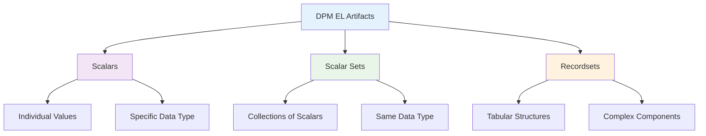
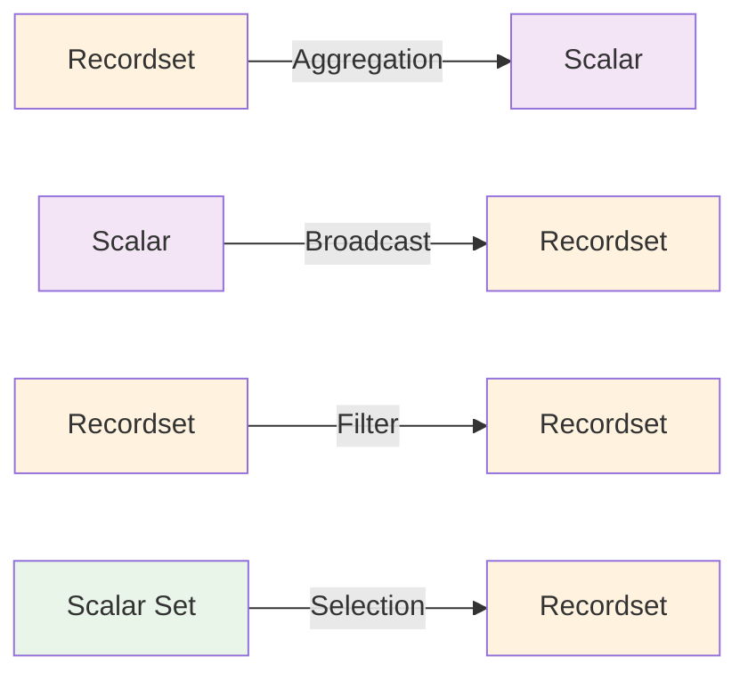

# Language Artifacts

Language artifacts are the fundamental data structures that DPM Expression Language operates on and produces as results. Understanding these artifacts is crucial for both writing expressions and implementing execution engines.

## The Three Artifact Types

DPM-XL calculations can operate on and generate three distinct types of artifacts:



## Artifact Hierarchy

The artifacts form a conceptual hierarchy from simple to complex:

### Level 1: [Scalars](scalars.md)
The simplest artifacts - individual values with specific data types.
- Foundation for all other artifacts
- Direct representation of single data points
- Support all DPM data types

### Level 2: [Scalar Sets](scalar-sets.md) 
Collections of scalar values sharing the same data type.
- Used primarily with membership operations
- Enable set-based comparisons and validations
- Maintain type homogeneity

### Level 3: [Recordsets](recordsets.md)
Complex tabular data structures with rich component structure.
- Most powerful and flexible artifact type
- Support multi-dimensional data organization
- Enable complex analytical operations

## Key Characteristics

### **Type Consistency**
All artifacts maintain strict data type consistency:
- Scalars have a single, well-defined type
- Scalar sets contain only values of the same type
- Recordset components are individually typed

### **Operational Completeness**
The artifact system supports all required regulatory operations:
- Individual value calculations (scalars)
- Membership and set operations (scalar sets)
- Aggregation and analytical operations (recordsets)

### **Composability**
Artifacts can be combined and transformed:
- Operations can take multiple artifact types as input
- Results can be any artifact type
- Complex workflows through artifact transformation

## Usage Patterns

Different artifacts serve different purposes in typical expressions:

### **Scalars for Constants and Results**
```dpm-xl
{F_01.01, r0010, c0010} > 1000
```
- `1000` is a scalar constant
- Comparison result is a scalar boolean

### **Scalar Sets for Membership**
```dpm-xl
{F_40.01, c0015}[where TYC in {"LEI", "ISIN"}]
```
- `{"LEI", "ISIN"}` is a scalar set
- Used to filter recordset based on membership

### **Recordsets for Complex Data**
```dpm-xl
sum({F_20.05, r0020-0030, c0010} group by CNT)
```
- Selection produces a recordset
- Aggregation operates on recordset structure

## Transformation Between Artifacts

Operations can transform artifacts between types:



### Common Transformations
- **Recordset → Scalar**: Aggregation operations (`sum`, `count`, `max`)
- **Scalar → Recordset**: Broadcasting in binary operations
- **Recordset → Recordset**: Filtering, transformation, projection
- **Scalar Set → Recordset**: Through membership filtering

## Memory and Performance Considerations

Different artifacts have different computational characteristics:

### **Scalars**
- Minimal memory footprint
- Fast operations
- Direct value access

### **Scalar Sets**
- Moderate memory usage
- Set operations may require sorting/hashing
- Used primarily for lookup operations

### **Recordsets**
- Potentially large memory usage
- Complex operations requiring joins and grouping
- May require optimization for large datasets

## Design Principles

The artifact system follows several key design principles:

### **Minimal Complexity**
Only the necessary artifact types are provided - no artificial complexity.

### **Maximum Expressiveness**
The three types together can express all required regulatory calculations.

### **Type Safety**
Strong typing prevents errors and enables optimization.

### **Business Alignment**
Artifacts map naturally to business concepts (values, lists, tables).

---

!!! tip "Implementation Strategy"
    When implementing DPM-XL engines:
    
    1. **Start with Scalars** - Implement the basic value system first
    2. **Add Scalar Sets** - Implement set operations and membership
    3. **Build Recordsets** - Implement the full tabular structure
    4. **Optimize Later** - Get correctness first, then optimize for performance