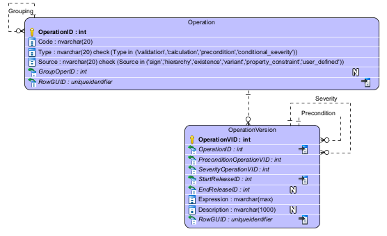
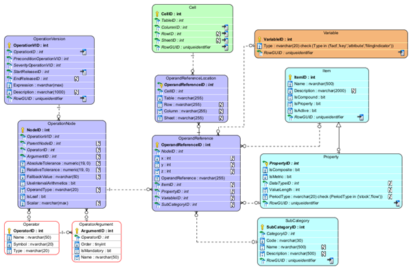
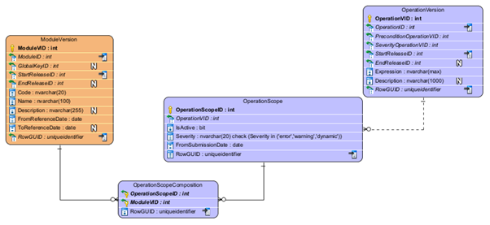
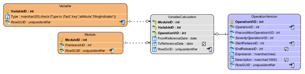

# 5 DPM-ML Metamodel

## 5.1 Operation and OperationVersion



Operations have a code and can be grouped.

Groups of operations refer to the cases where users define a parent validation and the system derives automatically children validations. There can only be two levels of operations (i.e., a child validation cannot be the parent of another validation). The types of validations that generate children are Variant and Property constraint validations (see below).

Operations and may be of any of 4 types:

- **Validation**: Operations that serve to validate the consistency of data. They can provide as output a scalar Boolean value or a recordset with scalar values.
- **Calculation**: Operations that serve to derive new data. They can provide as output any kind of data.
- **Precondition**: Operations that serve to determine whether one or more validations shall be applied. They can only provide as output a scalar Boolean value.
- **Conditional_severity**: Operations that serve to determine the severity of an invalid result for a validation. It can yield a value 'error' or 'warning'

Operations are also classified based on their source for generation as:

- **User_defined**: Operations that have been defined by users.
- **Hierarchy**: Validations that have been automatically generated by the system based on the contents of subhierarchies.
- **Sign**: Validations that have been automatically generated by the system based on the contents of the Sign attribute for TableVersionCells.
- **Existence**: Validations that have been automatically generated by the system based on the IsNullable attribute for TableVersionCells.
- **Variant**: Validations that are defined at the level of TableGroups, including the individual validations generated from them.
- **Property_contstraint**: Validations that are defined at the level of a property, and from which individual instances of validations based on variables are generated.

Operations can have many versions. A new version of an operation is required whenever any of the following attributes change:

- **Expression**: The DPM-XL expression of the version.
- **Description**: Natural language description of what the validation is aimed to check.
- **PreconditionOperation**: A link to an operation version that acts as precondition.
- **SeverityOperation**: A link to an operation that determines the conditional severity.

## 5.2 Operation tree



### 5.2.1 Operation nodes

The tree representation of an OperationVersion is provided in the OperationNode table.

Any Operation can be represented as a hierarchical tree, where the arguments of one Operator are represented.

For instance, the expression:

```
A = B + C
```

Can be represented as:

```
    =
   / \
  A   +
     / \
    B   C
```

Where "=" and "+" are operators, and "A", "B" and "C" are operands.

This kind of tree is represented in the OperationNode table.

### 5.2.2 Operands' representation

All Operands are represented as OperationNodes.

Operands that are Scalars not representing a DPM Object (like an Item) are completely represented in the OperationNode table.

Scalar Operands that are referring to a DPM Object need to be further specified with the tables OperandSource and OperandReference, which provide the reference to the DPM Object.

Operands that are Variables and Sets of Variables need also to be further specified with the tables OperandSource and OperandReference. Concretely, for Sets of Variables, it is important to determine the index of each Variable in the context of the Operand, to be able to match the variables to which the operator applies.

### 5.2.3 Representation example

For instance, suppose a table (Tab1) with three rows (100, 200 and 300), two columns (100 and 200) and two sheets.

**Sheet A**

| | Column 100 | Column 200 |
|---|---|---|
| **Row 100** | 1 | 4 |
| **Row 200** | 2 | 5 |
| **Row 300** | 3 | 6 |

**Sheet B**

| | Column 100 | Column 200 |
|---|---|---|
| **Row 100** | 7 | 10 |
| **Row 200** | 8 | 11 |
| **Row 300** | 9 | 12 |

Note that each number in the cells represents the ID of the corresponding Variable.

The following expression:

```
{tTab1, r100, c*, s*} = 2 * ({tTab1, r200, c*, s*} + {tTab1, r300, c*, s*})
```

Would be represented as the following tree:

```
             =
           /   \
{tTab1, r100, c*, s*}   *
                       / \
                      2   +
                         / \
           {tTab1, r200, c*, s*} {tTab1, r300, c*, s*}
```

The representation in the DB would be as follows (only the relevant fields are shown, and for operators and argument simbols are used):

**OperationNode table**

| NodeId | ParentNodeID | Operator | Argument | OperandSourceId | Scalar |
|--------|--------------|----------|----------|-----------------|--------|
| 1 | | = | | | |
| 2 | 1 | | left | oprnd1 | |
| 3 | 1 | * | right | | |
| 4 | 3 | | left | | 2 |
| 5 | 3 | + | right | | |
| 6 | 5 | | left | oprnd2 | |
| 7 | 5 | | right | oprnd3 | |

**OperandReference table**

| NodeID | x | y | z | VariableID |
|--------|---|---|---|------------|
| 2 | 1 | 1 | 1 | 1 |
| 2 | 2 | 1 | 1 | 4 |
| 2 | 1 | 1 | 2 | 7 |
| 2 | 2 | 1 | 2 | 10 |
| 6 | 1 | 1 | 1 | 2 |
| 6 | 2 | 1 | 1 | 5 |
| 6 | 1 | 1 | 2 | 8 |
| 6 | 2 | 1 | 2 | 11 |
| 7 | 1 | 1 | 1 | 3 |
| 7 | 2 | 1 | 1 | 6 |
| 7 | 1 | 1 | 2 | 9 |
| 7 | 2 | 1 | 2 | 12 |

Note that the operations shall be applied to the variables having the same index. For instance, Variable 1 = 2 * (Variable 2 + Variable 3), because all of them have the index y=1 and z=1.

## 5.3 Operation Scope



Each operation version can be applied in different scopes. An operation scope refers to the individual module versions or sets of module versions (for cross-module validations) to which the operation logically applies.

For each operation scope, there may be different values for the attributes:

- **IsActive**: Determines whether the operation shall be run for a certain scope.
- **Severity**: Determines the severity of the error, if the validation is not passed.
- **FromSubmissionDate**: Sets a date from which the validation applies to subsequent submissions.

## 5.4 Variable calculation



For calculations (i.e., operations that serve to calculate values for variables), it is necessary to link the operation to the actual variable that is generated. This is done with the VariableCalculation table, which links to the Variable and the Module. The link to the Module is necessary due to the fact that a Variable can be used in several Modules, being calculated in some cases and not calculated in other cases.