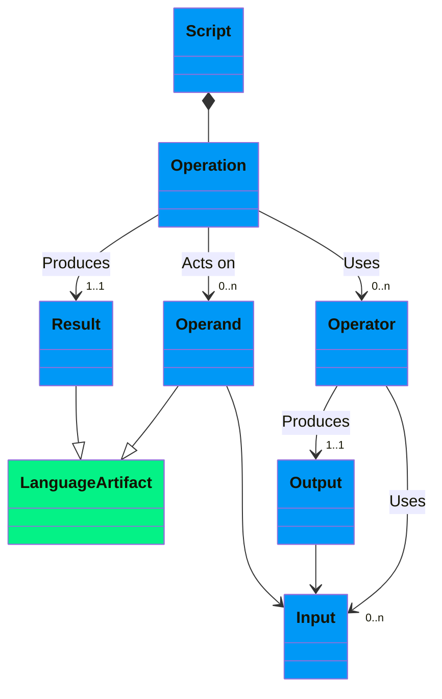
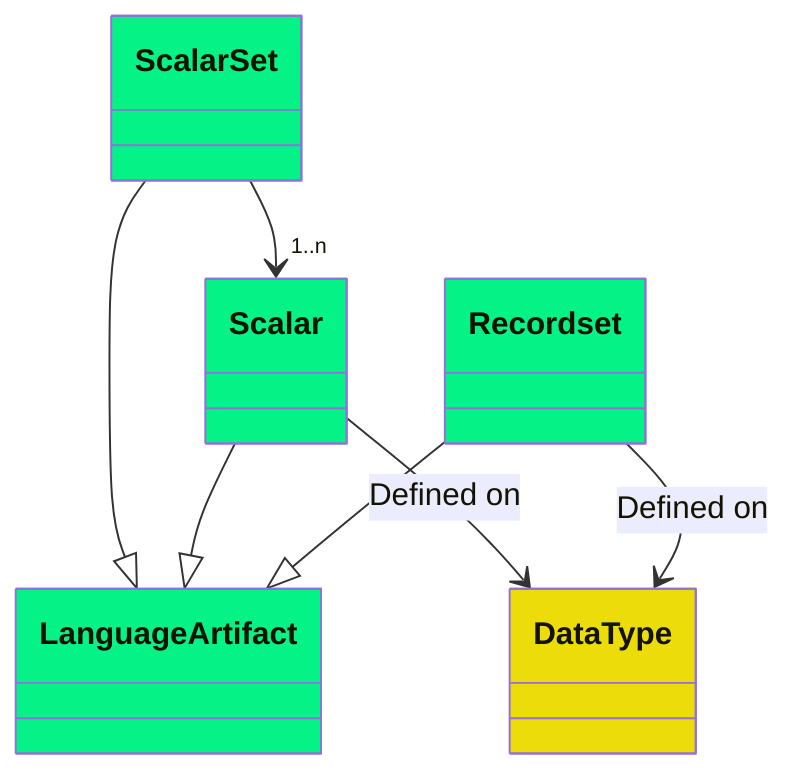
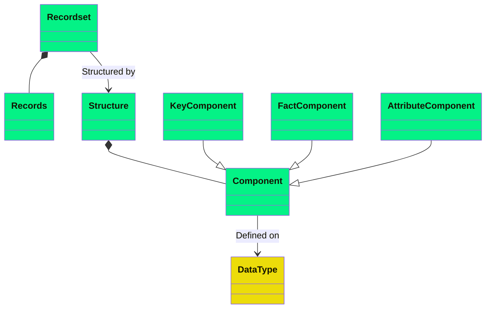
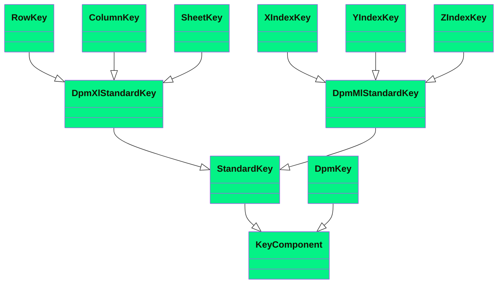

# 2 Information Model

## 2.1 Operations




The DPM Operations serve to write Scripts, which are computer programs that constitute a run-time and are composed of Operations.

Operations are expressions that use input operands and/or operators to produce a result.

Expressions are finite combinations of symbols that are well-formed according to the syntactical rules of the language. Expressions compose some operands in a certain order by means of the operators of the language, to obtain the desired result. The symbols of the expression designate operators, operands, and the order of application of the operators.

Operators specify a type of operation to be performed on some input operands (exceptionally, there may be operators that do not take operands as input, e.g., an operator to get the current time) to generate an output. The output produced by one operator may be used as input for another operator (i.e., operators can be nested).

Operands are specific artifacts from the DPM Expression Language referenced in an expression as input.

The result produced by an operation is also a specific artifact from the DPM Expression Language.

## 2.2 Language artifacts



DPM Expression Language calculations can operate on and generate as results three different type of Artifacts.

### 2.2.1 Scalars

Scalars are individual values of a certain Data Type.

### 2.2.2 Scalar sets

Scalar Sets are sets of Scalar values defined on the same Data Type. Scalar Sets are typically used with the in operator.

### 2.2.3 Recordsets



Recordset are collections of Records that share a same Structure. Technically, Recordsets are two-dimensional labelled data structures (tabular), which can be assimilated to Relational Tables or Data Frames. The columns (fields) of the Recordset are provided by the Components of its Structure. The rows of the Recordset are its composing Records.

The Structure of the Recordset is a collection of Components, which can have one of three roles: Key, Fact or Attribute. Each Component has a name, which must be unique within the Recordset. Key and Attribute Components are defined on a Data Type. Fact Components may be defined on more than one Data Type, when more than one variable is selected. In any case, the Data Type is known for each selected Variable.

Each Record of the Recordset is individually identified by the combination of the values for its Key Components.

A Recordset having no Key Components behaves like a Scalar.

#### 2.2.3.1 Key components



Key Component may be Standard or DPM. Standard Key Components are different for DPM-ML and DPM-XL, although their behaviour is the same.

Standard Key Components are common to all the Recordsets, independently on how the Variables are defined in the DPM. For each Recordset, there may be 0 or 1 occurrence of each subtype of Standard Key Component.

##### 2.2.3.1.1 Standard DPM-XL Key Components

- **Row Key**: Identifies the Row Ordinate from a Report Table where the selected Variable is located. Arises in Variable Set Selections, when more than one Row for one Report Table is selected. The name for the component is "r". It is defined on the String Data Type.
- **Column Key**: Identifies the Column Ordinate from a Report Table where the selected Variable is located. Arises in Variable Set Selections, when more than one Colum for one Report Table is selected. The name for the component is "c". It is defined on the String Data Type.
- **Sheet Key**: Identifies the Sheet Ordinate from a Report Table where the selected Variable is located. Arises in Variable Set Selections, when more than one Sheet for one Report Table is selected. The name for the component is "s". It is defined on the String Data Type.

##### 2.2.3.1.2 Standard DPM-ML Key Components

Regarding the DPM-ML, the Standard Components are three indexes, which do not represent any DPM object. They just serve to make sure that the right variables are matched together when used with an operator. The names for these Components are "x", "y" and "z". Note that these indexes do not necessarily correspond to rows, columns, and sheets. During the conversion from DPM-XL, the values of the indexes for each variable shall be provided according to algorithms.

##### 2.2.3.1.3 DPM Key Components

DPM Key Components are specific to how data is defined in the DPM. Arise when Open Variables are selected, and a Recordset will have one DPM Key Component per each Key Variable associated to the selected Variables.

The name for the DPM Key Components is the Code of the Property associated to the DPM Key Variable.

#### 2.2.3.2 Fact Component

A Recordset has one mandatory, and only one, Fact Component. The name for the component is "f" Its data type depends on the Data Type of the selected Variables.

If a DPM Key Variable is selected, the resulting Recordset will have the values for that Variable in the Fact Component, on top of having them in their corresponding Key Component. See example in section 2.2.4.4.

#### 2.2.3.3 Attribute Components

Attribute Components provide additional information to the Fact value.

DPM Attribute Components are specific to how data is defined in the DPM. Arise when a Variable with associated Attribute Variable is selected. A Recordset will have one DPM Attribute Component per each Property or Metric associated to any Attribute Variable associated to the selected Variables.

The name for the DPM Attribute Components is the Code of the Property associated to the DPM Attribute Variable.

### 2.2.4 Examples

Recordsets arise from Open Variable selections or from selection of multiple Variables.

#### 2.2.4.1 Closed Variable Selection

For instance, taking as an example EBA's Table F 01.01:

```
{tF_01.01, r0010, c0010}
```

In the context of a single instance (i.e., disregarding the "ref_date" and the "subject"), selects a Recordset without Key Components, which works as a scalar with value 100.

In the context of data with multiple dates and/or reference dates, and supposing that the data refer to the subject with code "id123" and to the date 31/12/2020, and that it has been reported with a 1 precision (attribute):

| subject | ref_date | f | p |
|---------|----------|---|---|
| id123 | 2020-12-31 | 100 | 1 |

#### 2.2.4.2 Open Variable Selection

```
{F 40.01 c0031}
```

Selects an Open Variable. In this illustrative example, yields a Recordset with three Records. The Recordset, in the context of a single instance, has two DPM Key Components, because the selected Variable (the one rendered in Column 0031 of Report Table F 40.01) is associated in the DPM to a Key with two Key Variables. These Key Variables are associated to Properties with codes "LIN" (rendered in Column 0011) and "TYC" (rendered in Column 0015).

The following table represents the Recordset:

| LIN | TYC | f |
|-----|-----|---|
| 123456 | LEI | Name 1 |
| 123456 | ISIN | Name 2 |
| 1111 | LEI | Name 3 |

#### 2.2.4.3 Variable Set Selection

```
{F 20.05 r0020-0030, c0010}
```

This case selects a set of Variables because the selection includes more than one Row. This implies that the Row Key Component applies to this Recordset. Besides, the selected Variables are associated to a Key with a single Key Variable, which is associated to a property with code "RCP".

| RCP | r | f |
|-----|---|---|
| ES | 0020 | 200 |
| ES | 0030 | 300 |
| PT | 0020 | 500 |
| PT | 0030 | 600 |

In this case, the recordset for the DPM-ML would be slightly different because of the change in the Standard Key Component. Instead of the row, we would have any of the three indexes. For instance, using the x index:

| RCP | x | f |
|-----|---|---|
| ES | 1 | 200 |
| ES | 2 | 300 |
| PT | 1 | 500 |
| PT | 2 | 600 |

Note that the important thing for DPM-ML to be consistent is that all the records with the same row share the same index.

#### 2.2.4.4 Key Variable Selection

```
{F 40.01 c0015}
```

Selects an Open Key Variable. The Recordset, in the context of a single instance, has two DPM Key Components, because the selected Variable (the one rendered in Column 0015 of Report Table F 40.01) is associated in the DPM to a Key with two Key Variables (in fact, it is part of the Key). These Key Variables are associated to Properties with codes "LIN" (rendered in Column 0011) and "TYC" (rendered in Column 0015).

The following table represents the Recordset:

| LIN | TYC | f |
|-----|-----|---|
| 123456 | LEI | LEI |
| 123456 | ISIN | ISIN |
| 1111 | LEI | LEI |

Note that the resulting Recordset has the values for the type of code two times, one as Key Component and another as Fact Component. This is necessary to allow doing calculations on the Fact while keeping all the Records in the Recordset uniquely identified.

## 2.3 Data types

DPM Operations data types are defined with the principle: Create only a data type if they have different behaviour to other data types with at least one operator.

The data types are:

- **String**: Sequence of alphanumeric characters of any length.
- **Number**: Is a rational number of any magnitude and precision, also used as approximation of a real number. Numbers can be treated as points or as intervals. Intervals are defined as a centre plus and minus a radius (c ± r). The centre is the input value provided. The radius is calculated based on the precision of the number as 10⁻ᵖ/2.
- **Integer**: Positive and negative integer numbers and zero. It Is a subtype of the type number. As number subtypes, integers can be treated as intervals.
- **Time interval** denotes time intervals of any duration and expressed with a precision. According to ISO 8601 (ISO standard for the representation of dates and times), a time interval is the intervening time between two time points.
  - **Date** is a subtype of the type time which denotes time points expressed at any precision, which are time intervals starting and ending in the same time point (i.e., intervals of zero duration). A value of type date includes all the parts needed to identify a time point at the desired precision, like the year, the month, the day, the hour, the minute and so on (for example, 2018-04-05 is the fifth of April 2018, at the precision of the day).
  - **Time period** is a subtype of the type time, and denotes non-overlapping time intervals having a regular duration (for example the years, the quarters of years, the months, the weeks and so on). A value of the type time period is composite and must include all the parts needed to identify a regular time period at the desired precision; in particular, the time-period type includes the explicit indication of the kind of regular period considered (e.g., "day", "week", "month", "quarter" …). For example, the value 2018M04, assuming that "M" stands for "month", denotes the month n.4 of the 2018 (April 2018). Moreover, 2018Q2, assuming that "Q" stands for 1896 "quarter", denotes the second quarter of 2018. In these examples, the letters M and Q are used to denote the kind of period through its duration.
- **Boolean**: denotes a logical binary state, meaning either "true" or "false".
- **Category items**: A reference to the code of a Category Item.
- **Subcategories**: A reference to the code of a Subcategory.

### 2.3.1 Correspondences with DPM data types

The DPM provides a wider list of data types. This is because greater granularity in the data typology may be useful for reporting or representation purposes (e.g., a monetary amount requires a currency attribute, while a pure number does not).

For each DPM data type there is one, and only one DPM Operations data type.

### 2.3.2 Casting

The casting between data types is possible. Casting can be done explicitly, if the cast operator is used, or implicitly when it is allowed. The following table contains all the casting options.

|  | String | Number | Integer | Time interval | Date | Time period | Duration | Boolean | Item | Subcategory |
|---|---|---|---|---|---|---|---|---|---|---|
| **String** | | Explicit | Explicit | Explicit | Explicit | Explicit | Explicit | Explicit | Explicit | Explicit |
| **Number** | Implicit | | Explicit | Not possible | Not possible | Not possible | Not possible | Not possible | Not possible | Not possible |
| **Integer** | Implicit | Implicit | | Not possible | Not possible | Not possible | Not possible | Not possible | Not possible | Not possible |
| **Time interval** | Implicit | Not possible | Not possible | | Explicit | Explicit | Not possible | Not possible | Not possible | Not possible |
| **Date** | Implicit | Not possible | Not possible | Implicit | | Explicit | Not possible | Not possible | Not possible | Not possible |
| **Time period** | Implicit | Not possible | Not possible | Implicit | Not possible | | Not possible | Not possible | Not possible | Not possible |
| **Duration** | Implicit | Not possible | Not possible | Not possible | Not possible | Not possible | | Not possible | Not possible | Not possible |
| **Boolean** | Implicit | Not possible | Not possible | Not possible | Not possible | Not possible | Not possible | | Not possible | Not possible |
| **Item** | Implicit | Not possible | Not possible | Not possible | Not possible | Not possible | Not possible | Not possible | | Not possible |
| **Subcategory** | Implicit | Not possible | Not possible | Not possible | Not possible | Not possible | Not possible | Not possible | Not possible | |

### 2.3.3 Conventions to write scalars

To the effects of DPM-XL, when writing scalars, the following conventions should be followed:

- **String**: Between double quotes ("this is a string") or single quotes ('this is also a string')
- **Number**: Sequence of numeric digits. Dot (".") shall be used to separate the decimal and the integer part.
  - **Integer**: Sequence of numeric digits.
- **Time** Follows ISO 8601 (ISO standard for the representation of dates and times). Dates shall be written between hashes (#). A valid time representation is #2021-11-25/2021-12-25#
  - **Date** #2021-11-25#.
  - **Time period** #2021Q4#.
- **Duration** Following ISO8601: P[n]Y[n]M[n]DT[n]H[n]M[n]S. E.g.,: #P3Y6M4DT12H30M5S#
- **Boolean**: true or false.
- **DPM objects**: A string between brackets with two arguments, first the type and second the code. E.g., [item, eba_RT:x11], [subcategory, eba_CU:iso_currencies]