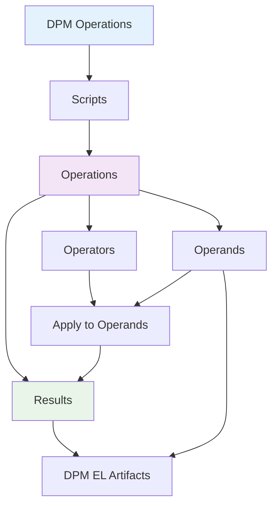

# Operations

Operations form the fundamental building blocks of DPM-XL, defining how expressions are structured and executed. Understanding operations is essential for both writing expressions and implementing execution engines.

## Conceptual Structure

Every operation in DPM-XL follows a consistent conceptual structure:



## Core Components

### Scripts
**Scripts** are complete computer programs composed of one or more operations. They represent:
- A complete validation or calculation routine
- A runtime execution context
- A collection of related operations

### Operations
**Operations** are individual expressions within a script that:
- Use input operands and operators to produce results
- Follow syntactical rules of the language
- Combine operands using operators in a specific order
- Generate outputs that can be used by other operations

### Operators
**Operators** specify the type of operation to be performed:
- Take operands as input (with rare exceptions like current time)
- Apply transformations or calculations
- Generate outputs for use in other operations
- Can be nested (output of one becomes input to another)

### Operands
**Operands** are the input data for operations:
- Specific artifacts from the DPM Expression Language
- Can be scalars, scalar sets, or recordsets
- Referenced within expressions as input values
- May come from data selections or previous operation results

### Results
**Results** are the outputs produced by operations:
- Also specific artifacts from the DPM Expression Language  
- Can be scalars, scalar sets, or recordsets
- May be used as operands in subsequent operations
- Represent the final or intermediate outcomes of calculations

## Expression Composition

Operations compose operands and operators according to specific rules:

### **Finite Combinations**
Expressions are finite combinations of symbols that are well-formed according to syntactical rules.

### **Ordered Application**
Operators are applied to operands in a specific order determined by:
- Operator precedence rules
- Explicit grouping (parentheses)
- Left-to-right evaluation for same precedence

### **Symbol Designation**
The symbols in an expression designate:
- **Operators**: What operation to perform
- **Operands**: What data to operate on  
- **Order**: How operations should be sequenced

## Operation Examples

### Simple Operation
```dpm-xl
{F_01.01, r0010, c0010} + {F_01.01, r0020, c0010}
```
- **Operands**: Two data selections
- **Operator**: Addition (`+`)
- **Result**: Sum of the two selected values

### Complex Operation
```dpm-xl
sum({F_20.05, r0020-0030, c0010} group by CNT) > 1000
```
- **Operands**: Data selection and literal value
- **Operators**: Aggregation (`sum`), comparison (`>`)
- **Result**: Boolean indicating if condition is met

### Nested Operations
```dpm-xl
max({F_01.01, r0010, c0010}, 
    min({F_01.01, r0020, c0010}, {F_01.01, r0030, c0010}))
```
- **Inner operation**: `min()` function
- **Outer operation**: `max()` function using inner result
- **Nesting**: Output of `min` becomes input to `max`

## Operation Flow

The execution of operations follows a well-defined flow:


### Step 1: Operand Selection
- Identify input data through selection expressions
- Retrieve values from data sources
- Validate operand types and structures

### Step 2: Operator Application
- Check operator constraints and requirements
- Apply operator logic to operands
- Handle special cases (nulls, empty sets, etc.)

### Step 3: Result Generation
- Produce output according to operator semantics
- Ensure result type matches operator specification
- Make result available for subsequent operations

## Operator Characteristics

### Input Flexibility
Most operators take operands as input, but some exceptions exist:
- **Current time operators**: Generate temporal values without input
- **Constant generators**: Produce predefined values
- **Context operators**: Access execution environment information

### Output Usage
Operator outputs can be:
- **Final results**: Terminal values for validation or calculation
- **Intermediate values**: Inputs for subsequent operations
- **Side effects**: Actions that don't produce direct outputs

### Nesting Capability
Operations support arbitrary nesting depth:
- Inner operations execute first
- Results flow outward through nesting levels
- Type compatibility must be maintained across nesting boundaries

## Validation and Constraints

Operations must satisfy several constraints:

### **Syntactic Validity**
- Must follow grammar rules
- Proper operator usage
- Valid operand references

### **Type Compatibility**
- Operands must match operator requirements
- Type casting rules apply where appropriate
- Result types must be predictable

### **Semantic Correctness**
- Operations must make business sense
- Data references must exist
- Constraints must be satisfiable

---

!!! note "Implementation Insight"
    Operations provide the execution model for DPM-XL engines. Each operation can be:
    
    - **Parsed** into constituent parts (operators, operands)
    - **Validated** for correctness and type safety
    - **Executed** to produce deterministic results
    - **Optimized** through caching and pre-computation