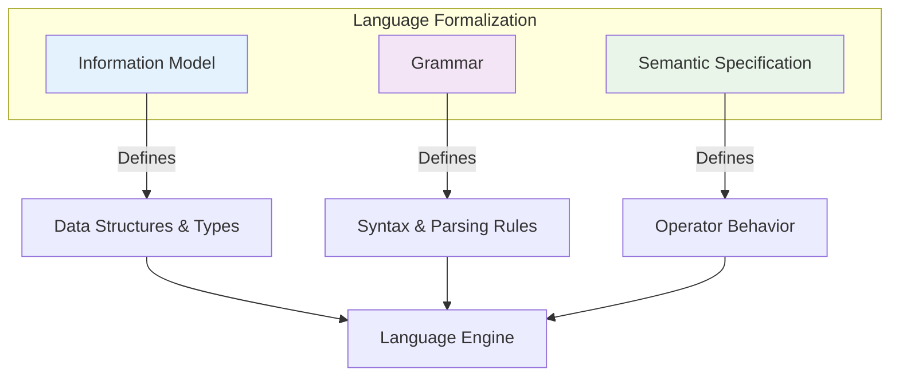

# Formalization Approach

The formalization of DPM-XL follows a systematic, three-pillar methodology that ensures complete specification while maintaining practical usability. This approach was inspired by the Validation and Transformation Language specification and adapted for the regulatory reporting domain.

## The Three Pillars

The formalization rests on three complementary pillars, each addressing different aspects of language specification:



## Pillar 1: Information Model

### Purpose
Defines the fundamental data structures and artifacts that the language operates on.

### Scope
- **Operation structure**: How expressions are composed
- **Language artifacts**: Scalars, scalar sets, and recordsets
- **Data types**: Number, string, boolean, time, etc.
- **Component types**: Keys, facts, and attributes
- **Casting rules**: Type conversion specifications

### Key Contributions
- Establishes the conceptual foundation
- Defines data structures independent of syntax
- Specifies type system and compatibility rules
- Provides the vocabulary for semantic specifications

### Example
```
Recordset Structure:
├── Key Components (unique identification)
├── Fact Component (the measured value)
└── Attribute Components (metadata)
```

## Pillar 2: Grammar

### Purpose
Provides the technical definition of language syntax using formal notation.

### Scope
- **Syntactic rules**: How expressions are structured
- **Token definitions**: Keywords, operators, literals
- **Precedence rules**: Order of operations
- **Parsing specifications**: How to build syntax trees

### Format
Extended Backus-Naur Form (EBNF) notation in separate specification files.

### Key Contributions
- Enables automatic parser generation
- Eliminates syntactic ambiguity
- Provides formal basis for tooling
- Ensures consistent interpretation across implementations

### Example (Conceptual)
```ebnf
expression ::= term (('+' | '-') term)*
term ::= factor (('*' | '/') factor)*
factor ::= number | '(' expression ')'
```

## Pillar 3: Semantic Specification

### Purpose
Formally defines the behavior and constraints of every operator in the language.

### Scope
- **Operator semantics**: What each operator does
- **Input constraints**: Valid parameter types and structures
- **Output specifications**: Result types and structures
- **Error conditions**: When operations fail
- **Edge case handling**: Null values, empty sets, etc.

### Key Contributions
- Ensures deterministic behavior
- Provides complete specification for implementation
- Covers all edge cases and error conditions
- Enables automated testing and verification

### Example
For the addition operator (`+`):
- **Input**: Two numeric operands (scalars or recordsets)
- **Output**: Numeric result with appropriate type promotion
- **Null handling**: Returns null if either operand is null
- **Recordset behavior**: Element-wise addition with key matching

## Integration and Consistency

The three pillars work together to provide a complete, consistent specification:

### Cross-Pillar Validation
- **Grammar validates Information Model**: Syntax supports all defined structures
- **Semantics reference Information Model**: Operators work on defined data types
- **Semantics constrain Grammar**: Legal syntax produces meaningful operations

### Consistency Checks
- All data types in the information model have corresponding grammar rules
- Every syntactic construct has defined semantics
- Semantic specifications match information model capabilities

## Reverse Engineering Approach

The formalization followed a pragmatic approach that prioritized backward compatibility and real-world usage:

### Starting Point
Rather than designing a new language from scratch, the formalization began with **existing validation rules** published by EBA and EIOPA.

### Methodology
1. **Analysis**: Examine existing semi-formal expressions
2. **Pattern Recognition**: Identify common structures and operators
3. **Abstraction**: Extract underlying concepts and rules
4. **Formalization**: Create precise specifications that support existing usage
5. **Extension**: Add necessary features while maintaining compatibility

### Key Principle
> The language that is currently used should change as little as possible.

This constraint ensured that:
- Existing rules remain valid
- Learning curve is minimized for current users
- Migration to formal specification is smooth
- Investment in existing rules is preserved

## Quality Assurance

The three-pillar approach includes built-in quality assurance mechanisms:

### Completeness Verification
- **Information Model**: All necessary data structures are defined
- **Grammar**: All language constructs have syntax rules
- **Semantics**: Every operator has complete behavioral specification

### Consistency Validation
- Cross-references between pillars are validated
- No contradictions between syntax and semantics
- Type system is coherent and complete

### Implementation Validation
- Formal specifications enable automated testing
- Reference implementations verify specification correctness
- Edge cases are explicitly handled

## Benefits for Implementers

This structured approach provides clear benefits for those implementing DPM-XL engines:

### **Clear Boundaries**
Each pillar has distinct responsibilities, making implementation more manageable.

### **Incremental Implementation**
Teams can implement pillars independently:
- Parser team focuses on grammar
- Type system team focuses on information model  
- Operator team focuses on semantics

### **Automated Validation**
Formal specifications enable:
- Automated test generation
- Specification compliance checking
- Cross-implementation validation

### **Future Evolution**
The three-pillar structure supports language evolution:
- New operators can be added with clear semantic specifications
- Grammar can be extended systematically
- Information model can evolve while maintaining backward compatibility

## Documentation Organization

This documentation follows the three-pillar structure:

| Pillar | Documentation Sections |
|--------|----------------------|
| **Information Model** | [Information Model](../information-model/), [Language Specification](../language-specification/) |
| **Grammar** | [Reference/Grammar](../reference/grammar.md) |
| **Semantic Specification** | [Operators](../operators/) sections |

Each section builds upon the others, creating a comprehensive and internally consistent specification.

---

!!! tip "Implementation Strategy"
    When implementing a DPM-XL engine:
    
    1. **Start with Information Model** - Understand data structures first
    2. **Implement Grammar** - Build parser for syntax validation
    3. **Add Semantics** - Implement operators one category at a time
    4. **Test Thoroughly** - Use formal specs to generate comprehensive test suites