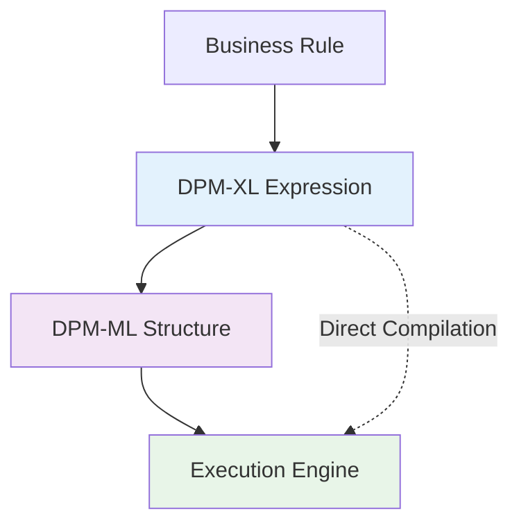

# DPM-XL and DPM-ML

The DPM Operations specification includes two complementary representations of the same logical operations: **DPM-XL** (expression language) and **DPM-ML** (metamodel language). Understanding when and why to use each representation is crucial for effective implementation.

## Two Representations, Same Semantics

Both DPM-XL and DPM-ML represent identical calculations and validations, but serve different purposes in the development and execution lifecycle:



## DPM-XL: The Expression Language

### Purpose
DPM-XL serves as the **primary interface** for business users and rule authors.

### Characteristics

#### **Human-Readable**
```dpm-xl
with {F_01.01, c0010, default:0}:
    {r0010} = {r0020} + {r0030} + {r0040}
```

#### **Business-Friendly Syntax**
- Uses familiar table, row, column references
- Intuitive operator names (`sum`, `count`, `max`)
- Natural expression structure

#### **Rendering-Based References**
- References data by table/row/column positions
- Matches how business users see and understand reports
- Aligns with existing documentation and specifications

### Use Cases
- **Rule authoring** by business analysts
- **Documentation** and communication
- **Validation** rule specifications
- **Training** and education materials

### Example
```dpm-xl
{F_40.01, c0031}[where LIN = "123456"] 
>= 0.8 * {F_40.02, c0060}[where LIN = "123456"]
```

## DPM-ML: The Metamodel Language

### Purpose
DPM-ML provides a **structured representation** optimized for storage, processing, and execution.

### Characteristics

#### **Structured Data**
- Database-friendly format
- No parsing required
- Direct processing by engines

#### **Variable-Based References**
- References actual business variables
- Stable over time (variables represent concepts)
- Independent of rendering changes

#### **Execution-Optimized**
- Tree structure for operator precedence
- Efficient processing algorithms
- Cacheable intermediate results

### Use Cases
- **Database storage** of operations
- **Execution engines** and compilers
- **Cross-language** translation
- **Performance optimization**

### Benefits

#### **Stability**
Variables represent business concepts that remain stable even when report layouts change.

#### **Performance**
No expression parsing during execution - structure is pre-computed.

#### **Flexibility**
Can be generated from languages other than DPM-XL if needed.

## Key Differences

| Aspect | DPM-XL | DPM-ML |
|--------|---------|---------|
| **Primary Users** | Business analysts, rule authors | Developers, execution engines |
| **Format** | Text expressions | Structured data (database tables) |
| **References** | Table/row/column (rendering) | Variables (business concepts) |
| **Parsing** | Required at runtime | Pre-parsed structure |
| **Readability** | High (business-friendly) | Low (technical structure) |
| **Stability** | Affected by layout changes | Stable over time |
| **Processing** | Parse → Execute | Direct execution |

## Standard Key Components

The two representations handle dimensional references differently:

### DPM-XL Standard Keys
- **Row Key (`r`)**: Identifies specific rows in tables
- **Column Key (`c`)**: Identifies specific columns in tables  
- **Sheet Key (`s`)**: Identifies specific sheets in tables

### DPM-ML Standard Keys
- **X Index**: Abstract index for matching variables
- **Y Index**: Abstract index for matching variables
- **Z Index**: Abstract index for matching variables

The indexes ensure proper variable matching during operations without depending on specific rendering positions.

## Conversion Process

DPM-ML is **automatically derived** from DPM-XL:


### Steps
1. **Parse** DPM-XL expression into syntax tree
2. **Resolve** table/row/column references to variables
3. **Transform** rendering keys to abstract indexes
4. **Generate** DPM-ML database structure

## Shared Elements

Both representations share:

- **Identical operators** and semantics
- **Same information model** (scalars, sets, recordsets)
- **Common data types** and casting rules
- **Identical null handling** and error conditions

---

!!! info "Implementation Guidance"
    **For Rule Authors**: Use DPM-XL for creating and documenting business rules
    
    **For Engine Developers**: Process DPM-XL input but execute using DPM-ML structures for optimal performance
    
    **For Integration**: Store operations in DPM-ML format for stability and efficiency