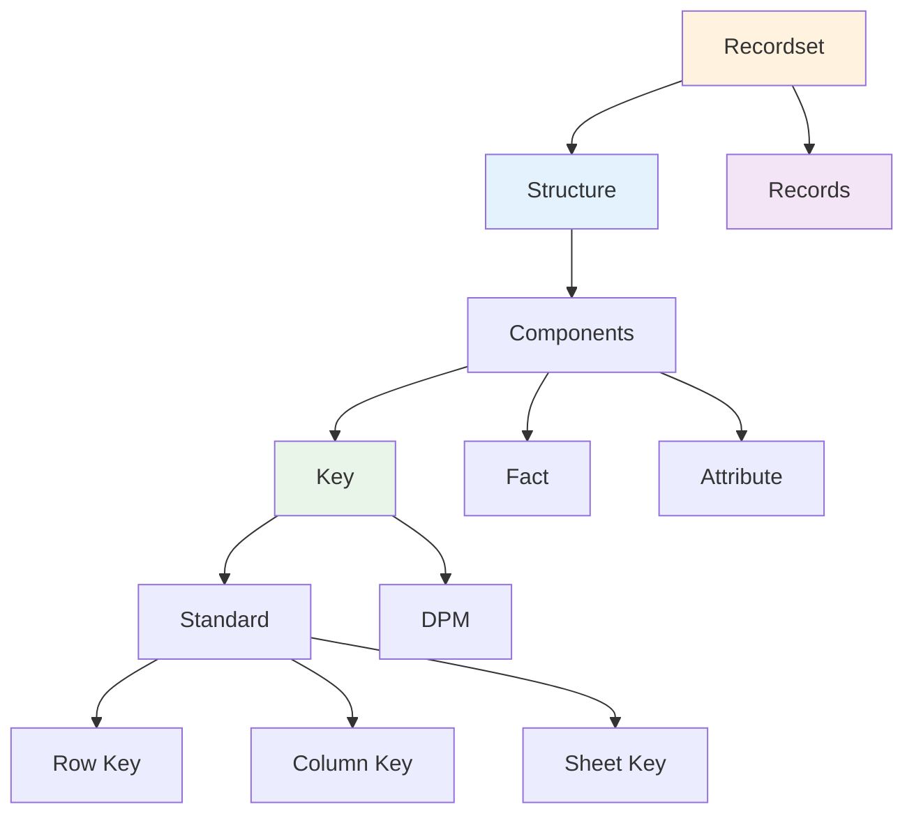

# Recordsets

Recordsets are the most complex and powerful language artifacts in DPM-XL, representing two-dimensional labeled data structures similar to relational tables or data frames. They enable sophisticated analytical operations and multi-dimensional data processing.

## Definition

**Recordsets** are collections of *Records* that share the same *Structure*. They are two-dimensional labeled data structures (tabular) that can be assimilated to Relational Tables or Data Frames.

## Core Structure



## Structure Components

The structure of a recordset consists of three types of components:

### **Key Components**
Provide unique identification for each record:
- Combination of key component values uniquely identifies each record
- Used for joining and matching operations
- Can be Standard or DPM-specific

### **Fact Component** 
Contains the primary measured value:
- Every recordset has exactly one fact component
- Named "f" by convention
- Contains the main data of interest

### **Attribute Components**
Provide additional metadata about the fact value:
- Optional components providing context
- Can include precision, currency, status codes, etc.
- Support rich data annotation

## Component Details

### Key Components

Key components come in two varieties:

#### **Standard Key Components**

##### DPM-XL Standard Keys
- **Row Key (`r`)**: Identifies the row ordinate from a Report Table
- **Column Key (`c`)**: Identifies the column ordinate from a Report Table
- **Sheet Key (`s`)**: Identifies the sheet ordinate from a Report Table

##### DPM-ML Standard Keys
- **X Index**: Abstract index for variable matching
- **Y Index**: Abstract index for variable matching  
- **Z Index**: Abstract index for variable matching

#### **DPM Key Components**
- Specific to how data is defined in the DPM
- One component per Key Variable associated to selected Variables
- Named using the Code of the Property associated to the Key Variable
- Data type matches the associated Property or Metric

### Fact Component
- Mandatory single component named "f"
- Data type depends on the selected Variables
- Contains the primary measurement or value
- When a Key Variable is selected, appears in both Key and Fact components

### Attribute Components
- Provide additional information about the Fact value
- One component per Property or Metric associated to Attribute Variables
- Named using the Code of the Property associated to the Attribute Variable
- Support metadata like precision, currency, validation status

## Record Structure

Each record in a recordset contains:
- **Values for all Key Components**: Providing unique identification
- **Value for the Fact Component**: The primary data
- **Values for Attribute Components**: Additional metadata

### Unique Identification
Each record is individually identified by the **combination of values for its Key Components**.

### Special Cases
- **No Key Components**: Recordset behaves like a Scalar
- **No Records**: Empty recordset is valid and maintains structure

## Creation Patterns

Recordsets arise from several types of data selections:

### **Open Variable Selections**
Select variables associated with keys, creating multi-record recordsets:
```dpm-xl
{F_40.01, c0031}  # Selects all values for an open variable
```

### **Variable Set Selections**
Select multiple variables, creating recordsets with standard key components:
```dpm-xl
{F_20.05, r0020-0030, c0010}  # Multiple rows create row key component
```

### **Closed Variable Selections**
Select single specific variables:
```dpm-xl
{F_01.01, r0010, c0010}  # Single cell, behaves like scalar
```

## Example Structures

### Simple Recordset
```
| CNT | f   |
|-----|-----|
| ES  | 100 |
| PT  | 200 |
| DE  | 300 |
```
- Key Component: CNT (country)
- Fact Component: f (value)
- 3 records

### Complex Recordset
```
| LIN    | TYC  | r    | f     | precision |
|--------|------|------|-------|-----------|
| 123456 | LEI  | 0020 | 1000  | 1         |
| 123456 | ISIN | 0020 | 2000  | 1         |
| 789012 | LEI  | 0030 | 3000  | 2         |
```
- Key Components: LIN, TYC, r
- Fact Component: f
- Attribute Component: precision
- 3 records

## Operations on Recordsets

### **Filtering**
Select subset of records based on conditions:
```dpm-xl
{F_40.01, c0031}[where TYC = "LEI"]
```

### **Aggregation**
Combine multiple records into summary values:
```dpm-xl
sum({F_20.05, r0020-0030, c0010} group by CNT)
```

### **Joining**
Combine recordsets based on common keys:
```dpm-xl
{F_01.01, c0010} + {F_01.01, c0020}  # Inner join on common keys
```

### **Transformation**
Modify structure or values:
```dpm-xl
{F_40.01, c0031}[rename TYC to TypeCode]
```

## Binary Operations with Recordsets

When recordsets are used in binary operations, they must satisfy compatibility constraints:

### **Exact Same Keys**
Both recordsets have identical key components:
```dpm-xl
{F_01.01, c0010} + {F_01.01, c0020}
```

### **Subset Keys**
One recordset's keys are a superset of the other's:
```dpm-xl
{F_40.01, c0110} >= {F_40.02, c0060}
# F_40.02 has additional key components
```

### **Inner Join Semantics**
Operations perform inner joins on common key components.

## Performance Characteristics

### **Memory Usage**
- Proportional to number of records × number of components
- Structure overhead is minimal
- Large recordsets may require optimization

### **Operation Complexity**
- **Filtering**: O(n) where n = number of records
- **Aggregation**: O(n) to O(n log n) depending on grouping
- **Joining**: O(n × m) to O(n + m) with proper indexing

### **Optimization Opportunities**
- **Indexing**: On key components for fast joins
- **Columnar storage**: For analytical operations
- **Lazy evaluation**: For chained operations

## Implementation Guidelines

### **Structure Definition**
```pseudo
class RecordsetStructure {
    List<Component> keyComponents;
    Component factComponent;
    List<Component> attributeComponents;
}

class Component {
    String name;
    DataType dataType;
    ComponentRole role;  // KEY, FACT, ATTRIBUTE
}
```

### **Record Storage**
```pseudo
class Recordset {
    RecordsetStructure structure;
    List<Record> records;
    
    Record findByKeys(Map<String, Value> keyValues);
    List<Record> filter(Predicate<Record> condition);
    Recordset join(Recordset other, JoinType type);
}
```

### **Efficient Access Patterns**
- **Primary index**: On all key components combined
- **Secondary indexes**: On individual key components
- **Column access**: For analytical operations

## Special Behaviors

### **Scalar-like Recordsets**
Recordsets with no key components behave like scalars:
- Single record (or no records)
- Operations treat them as scalar values
- Can be used wherever scalars are expected

### **Empty Recordsets**
Valid recordsets with no records:
- Maintain structure definition
- Aggregations return appropriate empty values (null, 0, etc.)
- Joins produce empty results

### **Key Variable Selection**
When selecting key variables, values appear in both key and fact components:
```
| LIN    | TYC  | f    |
|--------|------|------|
| 123456 | LEI  | LEI  |
| 123456 | ISIN | ISIN |
```
This enables calculations on key values while maintaining record identity.

## Common Patterns

### **Country-based Aggregation**
```dpm-xl
sum({F_20.05, r0020-0030, c0010} group by CNT)
```

### **Cross-table Validation**
```dpm-xl
{F_01.01, r0010, c0010} = sum({F_20.05, r0020-0030, c0010})
```

### **Conditional Processing**
```dpm-xl
if sum({F_01.01, r0010-0020, c0010}) > 1000 
then {F_01.01, r0030, c0010} 
else 0
```

---

!!! note "Recordset Design Philosophy"
    Recordsets bridge the gap between business concepts (tables, reports) and computational needs (structured data processing). They maintain the familiar tabular metaphor while enabling sophisticated analytical operations.