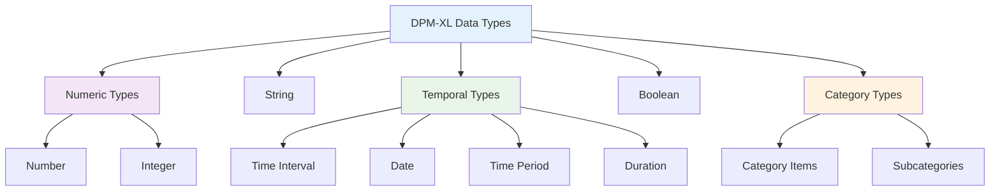

# Data Types

DPM-XL employs a carefully designed type system that balances expressiveness with operational efficiency. The guiding principle is: **Create only a data type if it has different behavior from other data types with at least one operator**.

## Type Hierarchy



## Core Data Types

### **String**
Sequence of alphanumeric characters of any length.

**Characteristics:**
- Variable length (no predefined limit)
- Unicode support for international characters
- Empty string is valid and equivalent to null

**Examples:**
```dpm-xl
"Hello World"
"Asset Class A"
""                    # Empty string
'Alternative syntax'  # Single quotes also valid
```

### **Number**
Rational number of any magnitude and precision, used as approximation of real numbers.

**Characteristics:**
- Arbitrary precision and magnitude
- Can be treated as points or intervals
- Intervals defined as center ± radius (c ± r)
- Radius calculated as 10^(-p)/2 where p is precision

**Examples:**
```dmp-xl
3.14159
-42.7
1000000.001
0.0001
```

### **Integer**
Positive and negative integer numbers and zero.

**Characteristics:**
- Subtype of Number
- Can be treated as intervals like Numbers
- Whole numbers only (no decimal component)

**Examples:**
```dpm-xl
42
-17
0
1000000
```

### **Boolean**
Logical binary state meaning either "true" or "false".

**Characteristics:**
- Only two valid values: `true` and `false`
- Supports three-valued logic with null
- Used in conditional and logical operations

**Examples:**
```dpm-xl
true
false
```

## Temporal Types

### **Time Interval**
Denotes time intervals of any duration expressed with precision.

**Characteristics:**
- Represents intervening time between two time points
- Follows ISO 8601 standard
- Can have various precisions (year, month, day, etc.)

**Examples:**
```dpm-xl
#2023-01-01/2023-12-31#    # Full year interval
#2023Q1/2023Q4#            # Multi-quarter interval
```

### **Date** *(subtype of Time Interval)*
Time points expressed at any precision - intervals of zero duration.

**Characteristics:**
- Includes all parts needed for desired precision
- Can represent year, month, day, hour, minute, second
- Always represents a specific point in time

**Examples:**
```dpm-xl
#2023-12-31#              # Specific date
#2023-12-31T14:30:00#     # Date with time
#2023#                    # Year precision
```

### **Time Period** *(subtype of Time Interval)*
Non-overlapping time intervals with regular duration.

**Characteristics:**
- Regular periods: years, quarters, months, weeks, days
- Composite values with duration type indicator
- Explicit indication of period type

**Examples:**
```dpm-xl
#2023M04#                 # April 2023 (month)
#2023Q2#                  # Second quarter 2023
#2023W15#                 # Week 15 of 2023
```

### **Duration**
Represents a length of time (not bound to specific dates).

**Characteristics:**
- Follows ISO 8601 duration format
- P[n]Y[n]M[n]DT[n]H[n]M[n]S pattern
- Can represent years, months, days, hours, minutes, seconds

**Examples:**
```dpm-xl
#P1Y#                     # 1 year
#P3M#                     # 3 months  
#P1Y6M#                   # 1 year and 6 months
#PT2H30M#                 # 2 hours 30 minutes
```

## Category Types

### **Category Items**
Reference to the code of a Category Item in the DPM model.

**Characteristics:**
- Points to specific items in DPM taxonomies
- Provides type-safe references to enumerated values
- Enables validation against official code lists

**Examples:**
```dpm-xl
[item, eba_RT:x11]
[item, "asset_class_equity"]
```

### **Subcategories**
Reference to the code of a Subcategory in the DPM model.

**Characteristics:**
- References collections of related category items
- Enables set-based operations on predefined groups
- Provides centralized maintenance of code lists

**Examples:**
```dpm-xl
[subcategory, eba_CU:iso_currencies]
[subcategory, "eu_member_states"]
```

## Type Correspondence with DPM Types

DPM-XL provides a simplified type system that maps to the more granular DPM data types:

| DPM Code | DPM Name | DPM-XL Type |
|----------|----------|-------------|
| `i` | integer | Integer |
| `r` | decimal | Number |
| `s` | string (non empty) | String |
| `b` | boolean | Boolean |
| `t` | true | Boolean |
| `dt` | date time | Date |
| `d` | date | Date |
| `e` | enumeration | Category Items |
| `m` | monetary | Number |
| `p` | percentage | Number |
| `u` | URI | String |
| `o` | ordinals | Integer |
| `es` | string (including empty) | String |

This mapping enables DPM-XL to work with existing DPM models while maintaining a simpler type system for operations.

## Type Casting

Type conversion between data types follows explicit rules:

### Casting Matrix

| From / To | String | Number | Integer | Time Interval | Date | Time Period | Duration | Boolean | Item | Subcategory |
|-----------|---------|---------|----------|---------------|------|-------------|----------|---------|------|-------------|
| **String** | - | Explicit | Explicit | Explicit | Explicit | Explicit | Explicit | Explicit | Explicit | Explicit |
| **Number** | Implicit | - | Explicit | ❌ | ❌ | ❌ | ❌ | ❌ | ❌ | ❌ |
| **Integer** | Implicit | Implicit | - | ❌ | ❌ | ❌ | ❌ | ❌ | ❌ | ❌ |
| **Time Interval** | Implicit | ❌ | ❌ | - | Explicit | Explicit | ❌ | ❌ | ❌ | ❌ |
| **Date** | Implicit | ❌ | ❌ | Implicit | - | Explicit | ❌ | ❌ | ❌ | ❌ |
| **Time Period** | Implicit | ❌ | ❌ | Implicit | ❌ | - | ❌ | ❌ | ❌ | ❌ |
| **Duration** | Implicit | ❌ | ❌ | ❌ | ❌ | ❌ | - | ❌ | ❌ | ❌ |
| **Boolean** | Implicit | ❌ | ❌ | ❌ | ❌ | ❌ | ❌ | - | ❌ | ❌ |
| **Item** | Implicit | ❌ | ❌ | ❌ | ❌ | ❌ | ❌ | ❌ | - | ❌ |
| **Subcategory** | Implicit | ❌ | ❌ | ❌ | ❌ | ❌ | ❌ | ❌ | ❌ | - |

**Legend:**
- **Implicit**: Automatic conversion when needed
- **Explicit**: Requires explicit cast operator
- **❌**: Not possible

### Casting Examples
```dpm-xl
cast(100, "string")           # "100"
cast("3.14", number)          # 3.14
cast(5, number)               # 5.0 (implicit)
cast("2023-12-31", date)      # #2023-12-31#
```

## Null Handling

All data types support the special value `null`:

### **Universal Null**
- Every data type includes `null` as a valid value
- Represents "no value", "absence of value", or "missing value"
- The same `null` value exists across all types

### **String Special Case**
For String data type, `null` is equivalent to empty string:
```dpm-xl
null = ""         # true in string context
```

### **Three-Valued Logic**
Boolean operations with null follow three-valued logic:
```dpm-xl
true and null     # null
false or null     # null
null = null       # null
```

## Interval Arithmetic

Numeric types (Number and Integer) support interval arithmetic:

### **Interval Representation**
- **Center**: The input value
- **Radius**: Calculated as 10^(-p)/2 where p is precision
- **Range**: [center - radius, center + radius]

### **Interval Operations**
Operations on intervals follow specific rules:
- **Addition**: centers add, radii add
- **Subtraction**: centers subtract, radii add  
- **Multiplication**: complex radius calculation
- **Comparison**: based on interval overlap

### **Example**
```dpm-xl
# Value 100 with precision 1 becomes interval 100 ± 0.05
# Range: [99.95, 100.05]
```

## Writing Scalar Literals

### **String Literals**
```dpm-xl
"Double quotes"
'Single quotes'
"String with spaces and symbols: @#$%"
""                    # Empty string
```

### **Numeric Literals**
```dpm-xl
42                    # Integer
-17                   # Negative integer
3.14159              # Number
-0.5                 # Negative number
```

### **Boolean Literals**
```dpm-xl
true
false
```

### **Temporal Literals**
```dpm-xl
#2023-12-31#         # Date
#2023Q4#             # Time period (quarter)
#2023M12#            # Time period (month)
#P1Y6M#              # Duration (1 year 6 months)
#2021-01-01/2021-12-31# # Time interval
```

### **DPM Object Literals**
```dpm-xl
[item, eba_RT:x11]
[subcategory, eba_CU:iso_currencies]
```

---

!!! tip "Type Design Philosophy"
    The DPM-XL type system prioritizes:
    
    1. **Operational Distinctness** - Types exist only when they behave differently
    2. **Business Relevance** - Types map to concepts business users understand  
    3. **Implementation Efficiency** - Simple enough for efficient execution
    4. **Regulatory Completeness** - Covers all scenarios needed for regulatory reporting