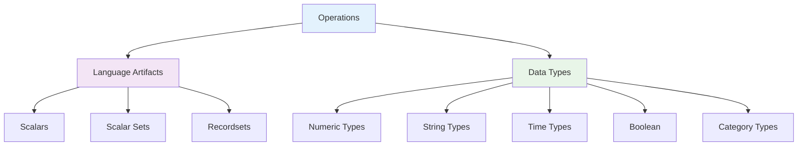

# Information Model

The Information Model forms the conceptual foundation of DPM-XL, defining the data structures, types, and relationships that the language operates upon. This model is independent of syntax and provides the vocabulary for all semantic specifications.

## Core Concepts

The Information Model centers around four fundamental concepts:

## What You'll Learn

This section provides comprehensive coverage of the Information Model through several focused areas:

### [Operations](operations.md)
The structural foundation of DPM-XL expressions:
- How operations are composed of operators, operands, and results
- The relationship between scripts and individual operations
- How operators transform operands into results

### [Language Artifacts](artifacts/)
The three core data structures that DPM-XL manipulates:
- **[Scalars](artifacts/scalars.md)**: Individual values of specific data types
- **[Scalar Sets](artifacts/scalar-sets.md)**: Collections of scalar values
- **[Recordsets](artifacts/recordsets.md)**: Complex tabular data structures

### [Data Types](data-types.md)
The complete type system including:
- Numeric types (Number, Integer, with interval support)
- Text types (String)
- Temporal types (Date, Time Period, Time Interval, Duration)
- Logical types (Boolean)
- Reference types (Category Items, Subcategories)
- Type casting and conversion rules

### [Examples](examples.md)
Practical illustrations showing how the Information Model concepts work together in real scenarios.

## Key Principles

The Information Model is designed around several key principles:

### **Type Safety**
Every operation has well-defined input and output types, with explicit casting rules where conversion is possible.

### **Structural Clarity**
Complex data structures (recordsets) have well-defined components with specific roles (keys, facts, attributes).

### **Business Alignment**
Data structures map directly to concepts familiar to business users (tables, rows, columns, variables).

### **Computational Completeness**
The model supports all operations needed for regulatory validation and calculation scenarios.

## Relationship to Implementation

While the Information Model is conceptual, it directly drives implementation requirements:

### **Memory Models**
Defines how data should be structured in memory during execution.

### **Type Systems**
Provides the specification for runtime type checking and casting.

### **Data Validation**
Establishes rules for validating input data and intermediate results.

### **Error Handling**
Specifies when operations should fail and what constitutes valid inputs.

## Model Independence

Importantly, the Information Model is:

- **Syntax Independent**: The same model applies to both DPM-XL expressions and DPM-ML structures
- **Implementation Independent**: Can be realized in any programming language or database system
- **Platform Independent**: Works across different execution environments

This independence ensures that the conceptual foundation remains stable even as syntax or implementation details evolve.

---

!!! info "Reading Guide"
    The Information Model sections build upon each other:
    
    1. Start with **Operations** to understand the basic structure
    2. Move to **Language Artifacts** to understand data structures
    3. Study **Data Types** for the complete type system
    4. Review **Examples** to see concepts in practice